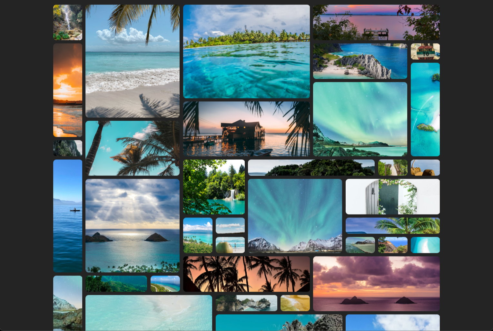

# Random Grid on reload photo gallery

project done in Vanilla HTML - CSS - JavaScript using Vite.

on each reload, every image that is fetched from unsplash, gets 2 random parameters for grid-column & grid-row so everytime the grid will be different.

The smaller the amount of objects in your project the harder for it to look good since it might leave empty spots on the grid.
